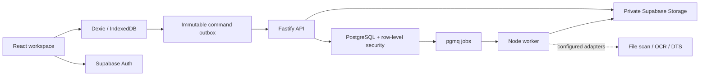

# Platform architecture

Ouranos keeps one intent entry point while sharing identity, storage and workflow infrastructure across modules. Travel is the first module; inventory and other workflows are not implemented.

| Layer | Implementation | Responsibility |
| --- | --- | --- |
| Frontend | React, TypeScript, Next-compatible routes through Vinext/Vite, Tailwind, shadcn, Magic UI | Minimal sign-in and intent entry; travel draft, workspace and review screens |
| Identity | Supabase Auth with email links and PKCE | User sessions; API verifies bearer tokens with Auth |
| API | Fastify, Zod, TypeScript SDK | Validated commands, queries, organization membership and signed file URLs |
| Database | PostgreSQL migrations and RLS | Organization and trip visibility; versions, revisions and audit history |
| Offline | Dexie / IndexedDB | Account/organization-scoped drafts, file bytes, immutable outbox and conflict state |
| Jobs | pgmq in PostgreSQL and a Node worker | Receipt processing and external delivery extension points |
| Files | Private Supabase Storage bucket | Original receipt bytes with server-side size, type and hash verification |
| Development | Supabase CLI and Docker | Local Auth, PostgreSQL, Storage and test email inbox |

Redis is not a dependency; PostgreSQL supplies the durable queue. Docker images and Compose are supplied for the API, worker and optional receipt services. Kubernetes is not required. The frontend build remains separate from the long-running API and worker.

## Authority and data flow

The browser sends a verified identity token and an organization id. The API derives the user from Supabase, starts a transaction as the restricted `ouranos_api` database role, and supplies the verified identity to row-level security. An organization id or a cached browser record never grants access. Ouranos tables live in their own `ouranos` schema. A separate worker login inherits `ouranos_worker`, with grants scoped to those tables and the Ouranos queue. It has no global RLS bypass. The worker and storage server key must remain server-side.

Roles are traveler, reviewer, approver, admin and auditor. A traveler edits their own trip. Administrators manage membership and routing; reviewers and approvers act on assigned steps. Trip visibility includes the owner, active admins/auditors, and assigned approval participants. Changes to one's own membership are prohibited through the API.

Each write carries a UUID command id, organization id, entity id, device id, expected entity version and contract schema version. Successful commands are recorded with a canonical payload hash. Retrying identical content returns its original result; reusing the id for different content is rejected. Versions prevent silent overwrite. A device id is scoped to one user and organization.

Commands, change publication, audit events and queue insertion share a transaction. An advisory lock serializes commits within each organization so synchronization cursors follow commit order. Receipt workers release this lock during storage and provider calls, then recheck the entity version/status and queue lease before finalization. Per-job session advisory locks deduplicate concurrent work. Worker database connections must use direct PostgreSQL or session pooling, not transaction pooling.

## Submission and review

Planning and voucher drafts carry `formSchemaVersion` plus opaque `formData`. Submission invokes the corresponding server validator, checks dependencies and routing, then freezes a snapshot in `submission_revisions`. Approval decisions refer to that frozen revision, not a mutable draft. Revisions, decisions and audit events have database immutability protections. Steps must run in order and the submitter cannot approve their own request.

The registered planning form captures traveler, origin and budget lines using integer minor-unit amounts. The approved-authorization endpoint returns the immutable reviewed snapshot, which is adapted into the existing voucher module's handoff. Voucher submission independently compares all client references and totals with persisted expenses, verifies linked receipts, and reruns reconciliation against that approved snapshot. Organization-specific policy, amendments and live DTS delivery remain separate work. Approval means approval within Ouranos, not DTS acceptance.

## Offline behavior

Draft edits and receipt capture update local records and the outbox atomically. Queued commands are immutable and replay with their original ids. Acknowledging an earlier edit does not erase later local edits. Version conflicts block that record for explicit resolution rather than silently overwriting it.

Sync scopes the local database by backend, user and organization, uploads receipt bytes, and refreshes a complete visible snapshot. It removes absent server-confirmed records while retaining pending drafts for resolution. The current snapshot has a ceiling of 2,000 records per entity kind; the incremental pull API exists, but the browser sync engine currently reconciles with bootstrap.

An already verified workspace can stay open during a connection loss. A fresh session must verify access online. Submission, review decisions and membership changes are online operations. The service worker caches only a static offline fallback; it does not cache authenticated navigation or API/auth responses. Closing or reloading offline is not equivalent to reopening a verified workspace.

IndexedDB is persistent browser storage, not an encrypted vault. Sign-out clears the active session and rendered workspace but retains scoped draft data on the device. Account/organization scoping prevents ordinary cross-session display; it is not a substitute for device protection or a production retention policy.

## Worker and provider boundaries

Jobs have visibility timeouts, idempotency keys, retry backoff and a failed-job table. The worker validates original file bytes before calling configured scan/OCR adapters; extracted values require a person to confirm the document. Provider failures do not become successful processing.

Disabled receipt providers produce `awaiting_provider`; after configuring both adapters, issue `document.reprocess`. DTS supports only disabled and development mock modes. Both preserve `externalAccepted: false`; production rejects mock mode. Deploying the frontend does not enable these providers.

The optional receipt service streams bytes to ClamAV, verifies signature freshness, and rejects malicious content before running Tesseract/Poppler. Extraction is bounded by file size, image dimensions, page count and timeout. It runs locally without a paid OCR API. Extracted fields remain suggestions until reviewed by the traveler.
